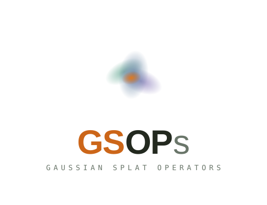

# GSOPs: Gaussian Splat Operators for TouchDesigner

Developed by [Lake Heckaman](https://www.lakeheckaman.com)

Custom operators for loading, editing, rendering, and animating 3D Gaussian Splats in TouchDesigner.

GSOPs are designed (as much as possible) in an unopinionated fashion to allow you to integrate them into your existing workflows without changing your process. The goal is to provide tools without enforcing adherence to any specific workflow, so your own creativity can shine. 

You can use GSOPs with any other POPs, meaning its easy to add your own feedback loops and effects as well.  

See below for usage, licensing and examples. There is a free version with basic funcationality and non-commercial license as well as the fully featured toolkit with commercial license, both available for download from **[Patreon here](https://www.patreon.com/collection/2236690)**

## Quick Start

<video src="examples/videos/gsop-quick-start.mp4" controls autoplay loop muted width="100%"></video>

0. Download the latest GSOPs release from **[Patreon here](https://www.patreon.com/collection/2236690)**, unzip it and drop the .tox `gsop_release_vX.X.X` into your network
1. Drop a **[GSOP Splat Scene](operators/gsop_splat_scene.md)** or **[GSOP Splat Scene Particles](operators/gsop_splat_scene_particles.md)** into your network
2. Set the splat file path parameter to your `.ply` or `.spz` file
3. Click **Init Splat Render Network** — auto-creates a Splat Geo, GSOP Splat Camera, and Render TOP
4. Done — you have a working Gaussian Splat render pipeline in TouchDesigner!

---

## Installation

**Prerequisite:** TouchDesigner 2025.33060 or later (see Usage Notes below)

Download the latest release from **[Patreon here](https://www.patreon.com/collection/2236690)**. The zip contains:

- `gsop_release_v{version}.tox` — drag-and-drop installer, all operators included
- `examples.toe` — interactive examples browser (bring your own splats)

1. Open your TouchDesigner project
2. Drag `gsop_release_v{version}.tox` into your network
3. GSOPs will appear as a new family in the TAB/OP Create dialog
4. I recommend you save this as a custom startup file by saving the .toe, then going to Edit > Preferences > Custom Startup File and pointing it to the .toe with GSOPs

To explore examples, open `examples.toe` from the release zip. It launches with a selection window — click any example to hot-load it instantly. Use the **Open Network** button to inspect the operator network for each example (similar to TD op snippets). Each example also has a wiki page and video: 

### GSOP Examples

Pre-built example networks for common GSOPs workflows — with screenshots and videos.

**[Browse Examples →](examples/README.md)**

### GSOPs Lite

If you only need basic Gaussian Splat rendering for non-commercial use only, or prefer not to subscribe for the full toolkit, you can download GSOPs Lite for free. 

This will include the bare bones needed to load several splats and render them quickly and easily, just like in the quick start video above

### Usage Notes

1. Built on Windows 11, Intel i9 14900, RTX 4090 24GB VRAM, TD 2025.33060
    - Splats consume VRAM — save often
    - Also tested on macOS (M3 chip). Working well but please report issues as you come across them. 
3. Intended for use with a Commercial TouchDesigner license for full features, but most operators work on Non-Commercial too.
4. When adding GSOPs, you might notice frame drops. These should be transitory and are due to VRAM re-allocation when dropping new operators.
5. Be careful as you develop. Gaussian splats and therefore GSOPs eat up VRAM, which can cause TD to crash. 
    - Monitor your VRAM usage with `nvidia-smi` in the terminal or using the "GPU" icon next to FPS in the TouchDesigner menu

## Architecture

Many GSOPs are view-dependent and require a Camera COMP reference. GSOPs solves this requirement with a `Splatscene` tag on the `gsop_splat_scene` or `gsop_splat_scene_particles` generator GSOPs. 

These `Splatscene` generators serve as the root for a render pipeline — normally you should only have one per renderTOP (you may still load in as many splats as possible via sequential parameters). It loads a splat file and holds camera/render references that propograte through the pipeline. 

Scene-dependent operators (like `gsop_frustum_delete`, `gsop_splat_geo`) must reference a `Splatscene` or they will throw errors. These operators all have a pulse parameter to auto-find a splat scene in the network (at the same level), but you can manually assign too via drag and drop.

**If you have any errors in rendering, first check that the `Splatscene` param references are all valid and correct. Then make sure your splat is transformed so its actually in the viewport**

---

## FAQ

New to GSOPs or hit a snag? Start here — splats not rendering, harmless load errors, supported formats, the free version, and more.

**[Read the FAQ →](faq.md)**

---

## Operator Categories

| Category | Description |
|----------|-------------|
| **IO** | Load and save splat files (PLY/SPZ formats) |
| **Edit** | Spatial modifications — bounding boxes, region constraints |
| **Optimization** | Performance operators — frustum culling, thinning, blowout |
| **Animation** | Particle systems, splat blending, dynamics |
| **Render** | Geometry generation, materials, post-effects |
| **UI** | Control panels and HUDs |

**[Browse Operators →](operators/README.md)**

## Operators

### IO

| Operator | Type | Description |
|----------|------|-------------|
| [Splat Scene](operators/gsop_splat_scene.md) | Generator | Loads a single splat file with camera and render pipeline |
| [Splat Particles Scene](operators/gsop_splat_scene_particles.md) | Generator | Loads multiple splats with particle system and blending |
| [Load Splat](operators/gsop_load_splat.md) | Generator | Loads a .ply or .spz file for the render pipeline |
| [Write Splat PLY](operators/gsop_write_splat_ply.md) | Generator | Writes splat to .ply file |

### Edit

| Operator | Type | Description |
|----------|------|-------------|
| [Bounding Box](operators/gsop_bounding_box.md) | Filter | Constrains splats to a bounding region |
| [Convert to ParticleSystem](operators/gsop_particle_system.md) | Filter | Converts splats into a particle system |

### Optimization

| Operator | Type | Description |
|----------|------|-------------|
| [Frustum Delete](operators/gsop_frustum_delete.md) | Filter | Culls splats outside the camera frustum |
| [Thin Splat](operators/gsop_thin_splat.md) | Filter | Reduces point count by percentage |
| [Blowout](operators/gsop_blowout.md) | Filter | Adds space between splats |

### Animation

| Operator | Type | Description |
|----------|------|-------------|
| [Attribute Blur](operators/gsop_attr_blur.md) | Filter | Blurs attribute values across neighboring points |

### Render

| Operator | Type | Description |
|----------|------|-------------|
| [Splat Geo](operators/gsop_splat_geo.md) | Filter | Generates renderable geometry with sorting and material |
| [Refractive](operators/gsop_refractive.md) | Filter | Refractive post-effect from POP geometry |
| [Splat Geo Equirectangular](operators/gsop_splat_geo_equirectangular.md) | Filter | Single-pass 360° equirectangular render |
| [Splat Geo Cubemap](operators/gsop_splat_geo_cubemap.md) | Filter | Seam-free cube map render, highest-quality 360° mode |

### UI

| Operator | Type | Description |
|----------|------|-------------|
| [Control Panel](operators/gsop_control_panel.md) | Filter | HUD for working with GSOPs |

---

## Changelog

Release-by-release notes, versioned to the `gsop_release_vX.Y.Z` builds.

**[View the Changelog →](CHANGELOG.md)**

---

## License

Copyright (c) 2025-2026 Lake Heckaman. All rights reserved.

GSOPs is available via Patreon subscription **[here](https://www.patreon.com/collection/2236690)**:

**Beta:** Currently available to all active **Integrate** tier subscribers. Tier structure is expanding soon:

| Tier | What's included |
|------|----------------|
| **Free** | GSOPs Lite — core operators for loa!ding and rendering splats, non-commercial use |
| **Create** | Full GSOPs, commercial use + all courses |

No redistribution, reverse engineering, or sublicensing permitted. **[Full License →](license.md)**

## Third-Party Licenses

Deployed via [TDFam](https://github.com/dotsimulate/TDFam), an open-source TouchDesigner operator-family framework created by Lyell Hintz / dotsimulate and Dan Molnar / function.str. Licensed under the Apache License 2.0.
