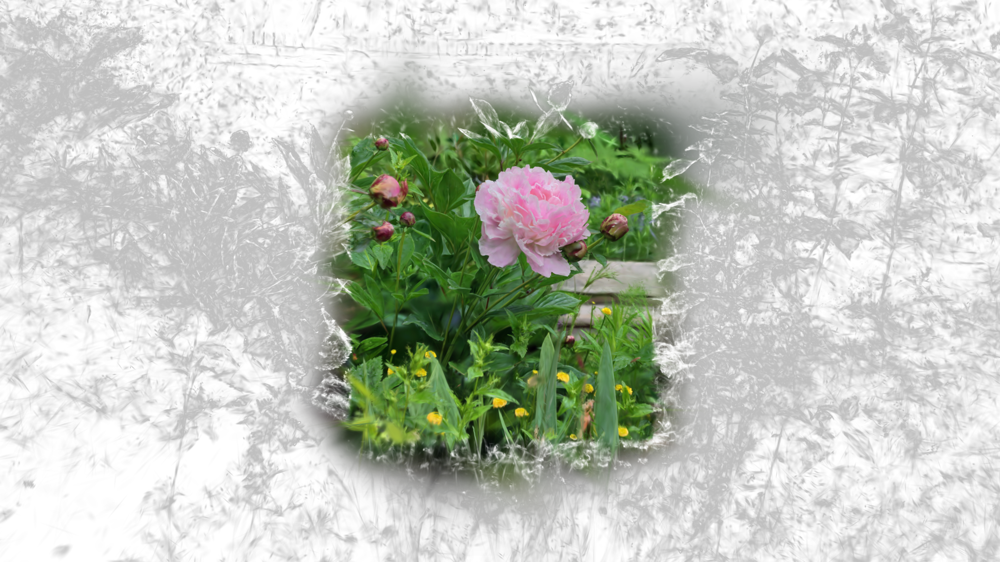
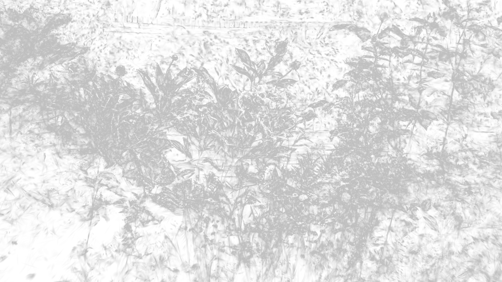

[Back to Examples](README.md)

# Alpha Texture Lookup

Use a texture to drive the detail bias and alpha mix parameters.

- **R** = Detail Bias
- **G** = Alpha Mix (`1 = render splat with color = vec4(alpha)`)

<video src="videos/gsop_alpha_texture.mp4" controls width="100%"></video>

<a href="videos/gsop_alpha_texture.mp4" target="_blank">↗ Open video in new tab</a>

## Operators

1. `gsop_camera_viewport` — or any TD camera (mind FOV and far clip settings)
2. `gsop_splat_scene_particles`
3. `gsop_splat_geo`
4. renderTOP

## Process

1. Drop the operators into your network - you will note the camera and `gsop_splat_geo` auto-find their respective renderTOP and splat scene components
2. Point `gsop_splat_scene_particles` to a `.ply` or `.spz` file
3. Open the GUI on `gsop_splat_scene_particles` and use the camera positioning window to orient the splat
4. Use the Alpha from Texture parameter and point it at your TOP
