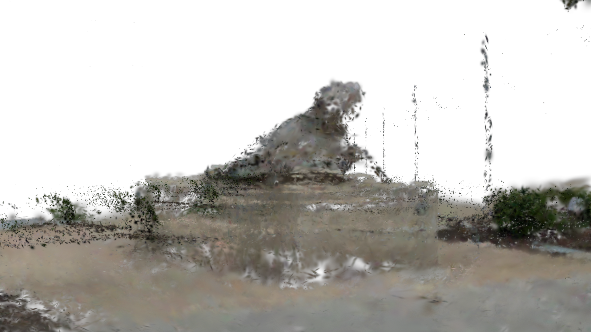

[Back to Examples](README.md)

# Attribute Blur

Blur an attribute across proximate splats. Works with any attribute of type float, vec2/3/4, or int.

<video src="videos/gsop_attr_blur.mp4" controls width="100%"></video>

<a href="videos/gsop_attr_blur.mp4" target="_blank">↗ Open video in new tab</a>

## Operators

1. `gsop_camera_viewport` — or any TD camera (mind FOV and far clip settings)
2. `gsop_splat_scene`
3. `gsop_attr_blur`
4. `gsop_splat_geo`
5. renderTOP

## Process

1. Drop the Splat Scene into your network and press 'Init Render Network'
2. Point `gsop_splat_scene` to a `.ply` or `.spz` file
3. Drop `gsop_attr_blur` between the scene and geo
4. Use the parameters to define the attribute you want blurred

## Notes

- Attribute type must match exactly.
