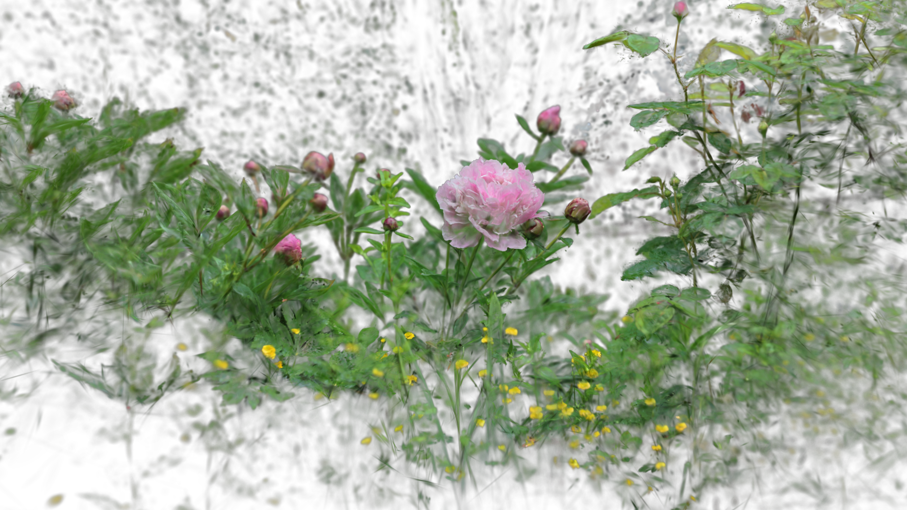

[Back to Examples](README.md)

# Bokeh Depth Slicing

Use the bokeh effect to 'slice' through splats.

<video src="videos/gsop_bokeh_slice.mp4" controls width="100%"></video>

<a href="videos/gsop_bokeh_slice.mp4" target="_blank">↗ Open video in new tab</a>

## Operators

1. `gsop_camera_viewport` — or any TD camera (mind FOV and far clip settings)
2. `gsop_splat_scene_particles`
3. `gsop_splat_geo`
4. renderTOP

## Process

1. Drop the operators into your network - you will note the camera and `gsop_splat_geo` auto-find their respective renderTOP and splat scene components
2. Point `gsop_splat_scene_particles` to a `.ply` or `.spz` file
3. Open the GUI on `gsop_splat_scene_particles` and use the camera positioning window to orient the splat
4. Use the Bokeh parameter on `gsop_splat_geo`. Set the focal length, band width, and strength. Use the Alpha Reduction parameter and Detail Bias to add the 'slicing' effect

## Notes

This can sometimes get heavy, especially with a really strong bokeh.
