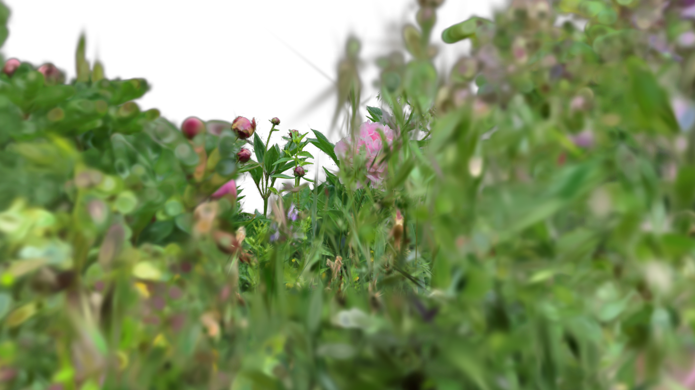

[Back to Examples](README.md)

# Bokeh Texture Lookup

Use the bokeh effect driven by a TOP.

<video src="videos/gsop_bokeh_texture.mp4" controls width="100%"></video>

## Operators

1. `gsop_camera_viewport` — or any TD camera (mind FOV and far clip settings)
2. `gsop_splat_scene_particles`
3. `gsop_splat_geo`
4. renderTOP

## Process

1. Drop the operators into your network - you will note the camera and `gsop_splat_geo` auto-find their respective renderTOP and splat scene components
2. Point `gsop_splat_scene_particles` to a `.ply` or `.spz` file
3. Open the GUI on `gsop_splat_scene_particles` and use the camera positioning window to orient the splat
4. Use the Bokeh from Texture parameter and point it at your TOP. White pixels get full bokeh, black gets none. Bokeh Strength still works as a multiplier

## Notes

This can sometimes get heavy, especially with a really strong bokeh.
