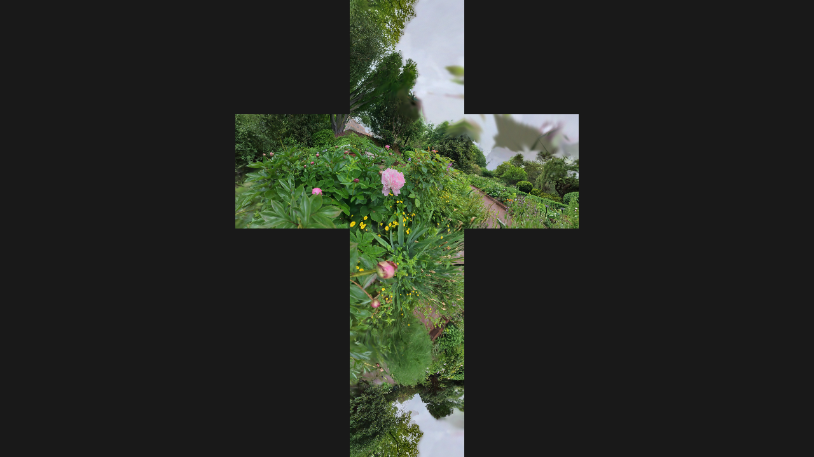

[Back to Examples](README.md)

# Cubemap Render

Render splats in cubemap projection, for use in immersive environments.

<video src="videos/gsop_cubemap_render.mp4" controls width="100%"></video>

<a href="videos/gsop_cubemap_render.mp4" target="_blank">↗ Open video in new tab</a>

## Operators

1. `gsop_camera_viewport` — or any TD camera (mind FOV and far clip settings)
2. `gsop_splat_scene`
3. `gsop_splat_geo_cubemap`
4. renderTOP

## Process

1. Drop the Splat Scene into your network and press 'Init Render Network'
2. Point `gsop_splat_scene` to a `.ply` or `.spz` file
3. Delete the auto-created `gsop_splat_geo` and drop a `gsop_splat_geo_cubemap`
4. Set the RenderTOP "Render Mode" parameter to "Cubemap" and make sure the resolution is square and lowish (e.g. 1024x1024)

## Notes

- Watch your resolution. Cubemap rendering is heavier than standard rendering, so be careful and save often.
- Relighting, bokeh and motion blur not yet supported in this render mode.
- You can visualize easily by applying the render to a box as the Color Map (set tex coordinates as Cube Map Inside).
- Can also use with a Projection TOP to convert to equirectangular, or as a projector Light source.

See also the [Splat Geo Cubemap](../operators/gsop_splat_geo_cubemap.md) operator reference.
