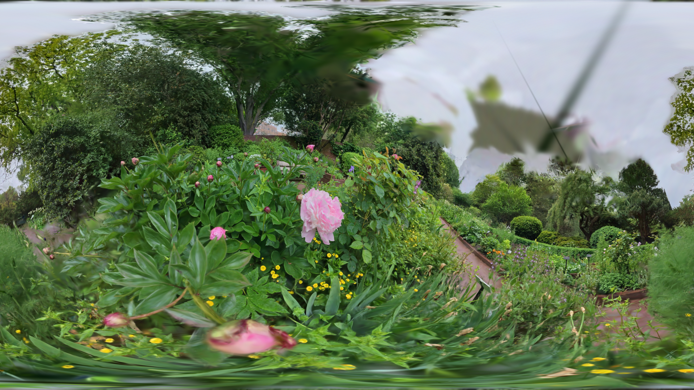

[Back to Examples](README.md)

# Equirectangular Render

Render splats in equirectangular perspective, for use in immersive environments or sphere mapping.

<video src="videos/gsop_equirectangular_render.mp4" controls width="100%"></video>

<a href="videos/gsop_equirectangular_render.mp4" target="_blank">↗ Open video in new tab</a>

## Operators

1. `gsop_camera_viewport` — or any TD camera (mind FOV and far clip settings)
2. `gsop_splat_scene`
3. `gsop_splat_geo_equirectangular`
4. renderTOP

## Process

1. Drop the Splat Scene into your network and press 'Init Render Network'
2. Point `gsop_splat_scene` to a `.ply` or `.spz` file
3. Delete the auto-created `gsop_splat_geo` and drop a `gsop_splat_geo_equirectangular`
4. Wire it in! Nothing else needed here

## Notes

- Watch your resolution. Equirectangular rendering is heavier than standard rendering, so be careful and save often.
- Relighting, bokeh and motion blur not yet supported in this render mode.
- You can visualize easily by applying the render to a sphere as the Color Map.

See also the [Splat Geo Equirectangular](../operators/gsop_splat_geo_equirectangular.md) operator reference.
