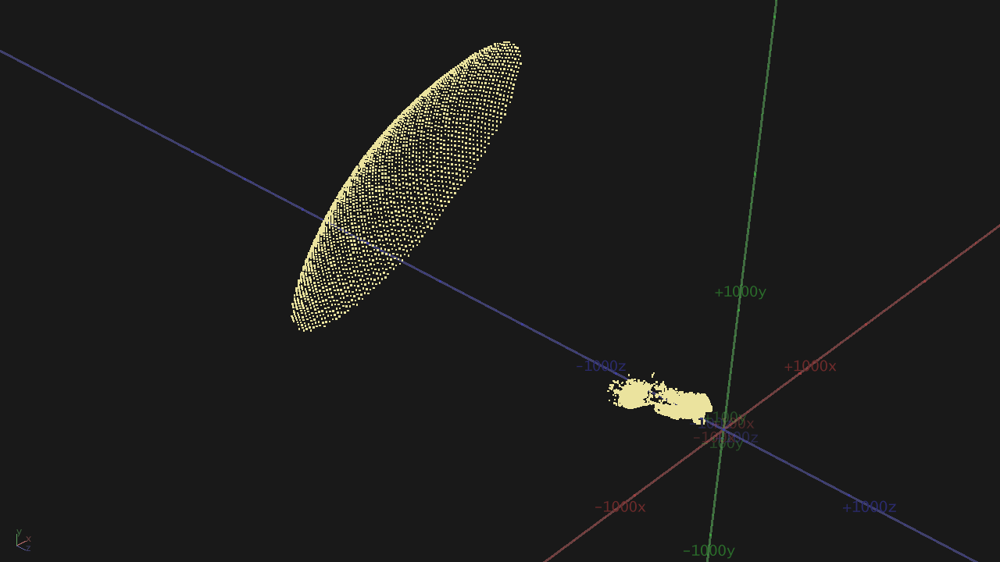

[Back to Examples](README.md)

# Frustum Delete

Remove splats that are outside of the camera's view, so they do not hit the render pipeline.

<video src="videos/gsop_frustum_delete.mp4" controls width="100%"></video>

<a href="videos/gsop_frustum_delete.mp4" target="_blank">↗ Open video in new tab</a>

## Operators

1. `gsop_camera_viewport` — or any TD camera (mind FOV and far clip settings)
2. `gsop_splat_scene`
3. `gsop_splat_geo`
4. renderTOP
5. `gsop_frustum_delete`

## Process

1. Add the `gsop_frustum_delete` operator between the `gsop_splat_scene` and `gsop_splat_geo`

## Notes

This should almost always be used immediately before `gsop_splat_geo`, as the impact is always there but never visible (by definition).
