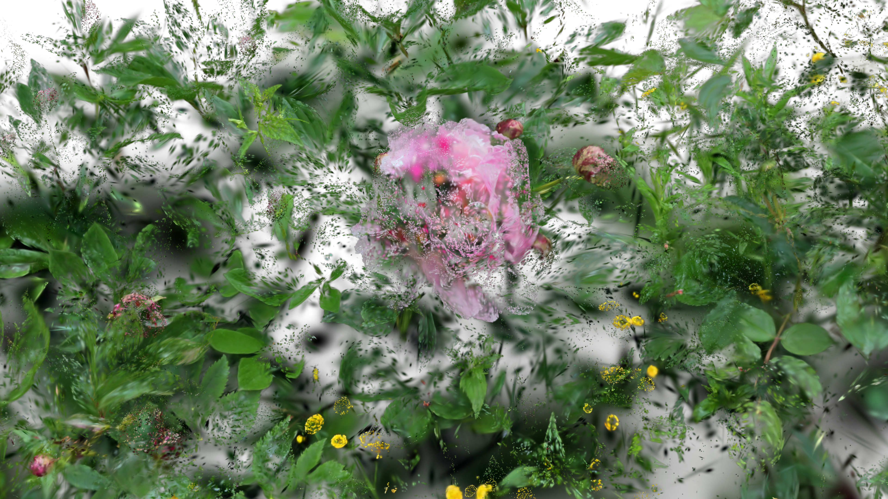

[Back to Examples](README.md)

# Minimal Splat Particles Scene

The simplest GSOP particle system setup — load a splat, turn it into a particle system and render it.

<video src="videos/gsop_particle_scene_minimal.mp4" controls width="100%"></video>

<a href="videos/gsop_particle_scene_minimal.mp4" target="_blank">↗ Open video in new tab</a>

## Operators

1. `gsop_camera_viewport` — or any TD camera (mind FOV and far clip settings)
2. `gsop_splat_scene_particles`
3. `gsop_splat_geo`
4. renderTOP

## Process

1. Drop the operators into your network - you will note the camera and `gsop_splat_geo` auto-find their respective renderTOP and splat scene components
2. Point `gsop_splat_scene_particles` to a `.ply` or `.spz` file
3. Open the GUI on `gsop_splat_scene_particles` and use the camera positioning window to orient the splat
4. Add more splats to the scene if desired using the sequential parameters and follow the same process to pre-transform each
5. Play with the Dynamics tab to add particle-based motion

## Notes

For a single splat, it might be easiest to move the cameraViewport to orient. However, when using more than one splat, the best workflow is to use the GUI to pre-transform each splat so you can keep a single, constant 'master camera' in your render setup to ensure consistency across splats.
