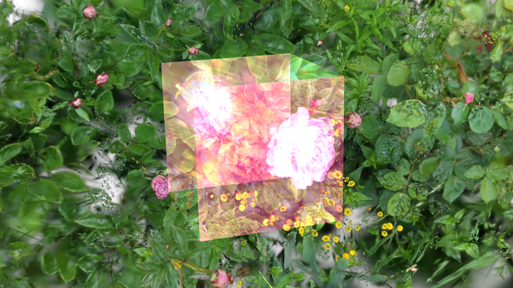

[Back to Examples](README.md)

# Refraction

Add refractive geometry to your scene (compatible with environment maps too).

<video src="videos/gsop_refract.mp4" controls width="100%"></video>

<a href="videos/gsop_refract.mp4" target="_blank">↗ Open video in new tab</a>

## Operators

1. `gsop_camera_viewport` — or any TD camera (mind FOV and far clip settings)
2. `gsop_splat_scene`
3. `gsop_splat_geo`
4. renderTOP
5. `gsop_refractive`

## Process

1. Drop the operators into your network - you will note the camera and `gsop_splat_geo` auto-find their respective renderTOP and splat scene components
2. Point `gsop_splat_scene` to a `.ply` or `.spz` file
3. Open the GUI on `gsop_splat_scene` and use the camera positioning window to orient the splat
4. Add more splats to the scene if desired using the sequential parameters and follow the same process to pre-transform each
5. Add a `gsop_refractive` operator and wire its output to replace the current renderTOP (because it uses another render pass)
6. Make sure to update your existing render to ONLY look at the `gsop_splat_geo` and whatever else you want to refract, so the refraction pass has a clean canvas to start on

## Notes

Make sure your existing renderTOP only looks at `gsop_splat_geo` (and whatever else you want refracted) — `gsop_refractive` needs a clean first pass to composite against.
