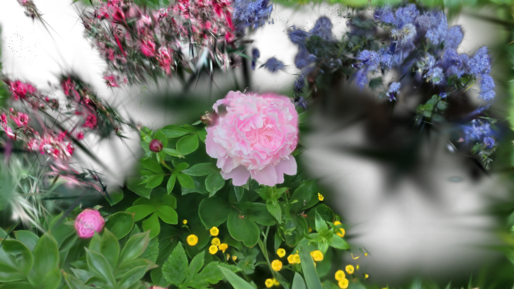

[Back to Examples](README.md)

# Particles Scene Blending via Texture Input

Load multiple splats and blend between them in real time using a texture-based input.

<video src="videos/gsop_splat_blending_texture.mp4" controls width="100%"></video>

<a href="videos/gsop_splat_blending_texture.mp4" target="_blank">↗ Open video in new tab</a>

## Operators

1. `gsop_camera_viewport` — or any TD camera (mind FOV and far clip settings)
2. `gsop_splat_scene_particles`
3. `gsop_splat_geo`
4. renderTOP

## Process

1. Drop the operators into your network - you will note the camera and `gsop_splat_geo` auto-find their respective renderTOP and splat scene components
2. Point `gsop_splat_scene_particles` to a `.ply` or `.spz` file
3. Open the GUI on `gsop_splat_scene_particles` and use the camera positioning window to orient the splat
4. Add more splats to the scene using the sequential parameters and follow the same process to pre-transform each
5. Use the TOP input of the `gsop_splat_scene_particles` op to drive the splat mixing. The texture should be 8-bit, [0,1] and will be remapped to the number of total splats loaded (e.g. `splatID = map(tex.r, 0,1,0,nSplats)`)

## Notes

Careful of your VRAM as you add splats. They can eat it up, especially big ones.
