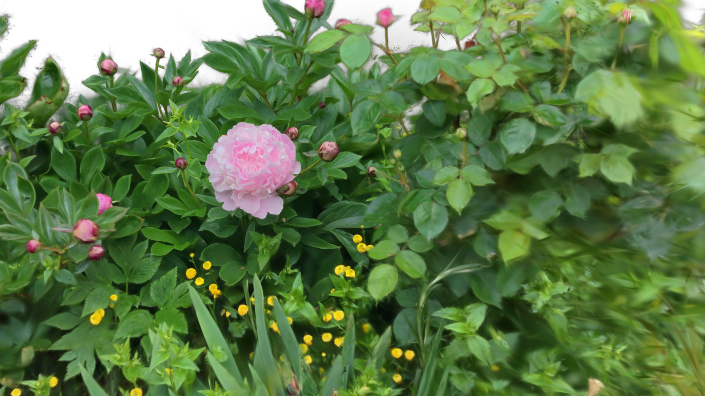

[Back to Examples](README.md)

# Minimal Static Scene

The simplest possible GSOPs setup — load a splat and render it.

<video src="videos/gsop_static_scene_minimal.mp4" controls width="100%"></video>

<a href="videos/gsop_static_scene_minimal.mp4" target="_blank">↗ Open video in new tab</a>

## Operators

1. `gsop_camera_viewport` — or any TD camera (mind FOV and far clip settings)
2. `gsop_splat_scene`
3. `gsop_splat_geo`

## Process

1. Drop the operators into your network
2. Point `gsop_splat_scene` to a `.ply` or `.spz` file
3. Open the GUI on `gsop_splat_scene` and use the camera positioning window to orient the splat
4. Add more splats to the scene if needed

## Notes

For a single splat, it might be easiest to move the cameraViewport to orient. However, when using more than one splat, the best workflow is to use the GUI to pre-transform each splat so you can keep a single, constant 'master camera' in your render setup to ensure consistency across splats.
