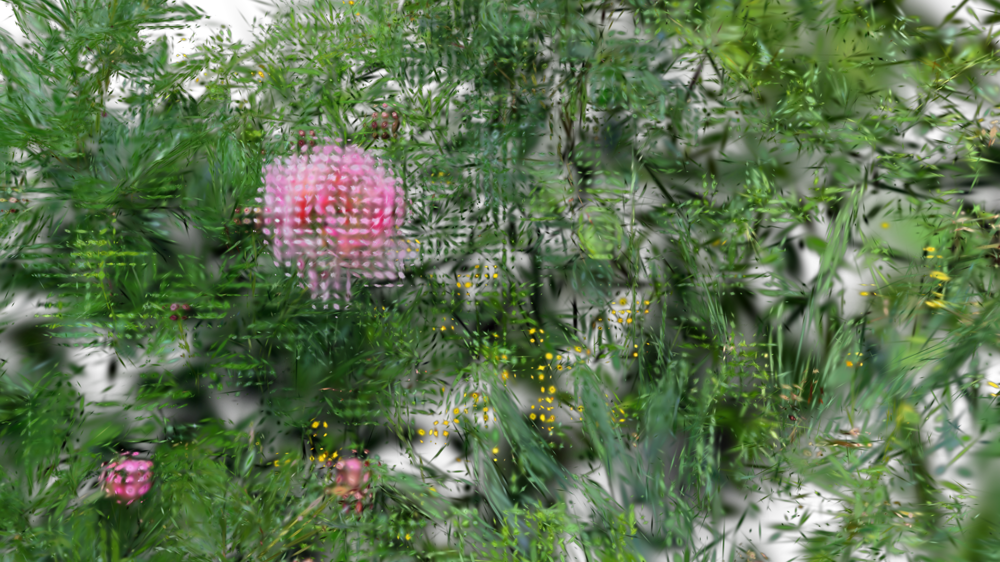
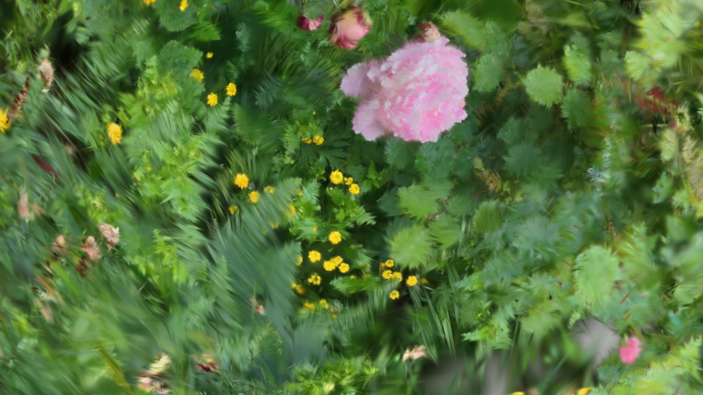

[Back to Examples](README.md)

# Add Your Own Effects to Any Scene

Easily add custom animation, dynamics or logic to GSOPs scenes using any other POPs.

<video src="videos/gsop_static_splat_feedback.mp4" controls width="100%"></video>

<a href="videos/gsop_static_splat_feedback.mp4" target="_blank">↗ Open video in new tab</a>

## Operators

1. `gsop_camera_viewport` — or any TD camera (mind FOV and far clip settings)
2. `gsop_splat_scene`
3. `gsop_splat_geo`
4. renderTOP
5. Any custom POP additions

## Process

1. Drop the operators into your network - you will note the camera and `gsop_splat_geo` auto-find their respective renderTOP and splat scene components
2. Point `gsop_splat_scene` to a `.ply` or `.spz` file
3. Open the GUI on `gsop_splat_scene` and use the camera positioning window to orient the splat
4. Add more splats to the scene if desired using the sequential parameters and follow the same process to pre-transform each
5. Add anything you want between the `gsop_splat_scene` and the `gsop_splat_geo` — feedback loops, noise, quantization, etc

## Notes

1. Pay attention to the attributes you are affecting and try others. It can, for example, be interesting to change both InitPos and P at the same time (or to write the new value of one onto the other prior to rendering).
2. Make sure your own additions go between the `gsop_splat_scene` and the `gsop_splat_geo` operators. This is required to ensure the rendering works as intended.
